# Mandelbrot Explorer — Real-Time Arbitrary-Precision Deep Zoom in the Browser


[](https://gcollombet.github.io/mandelbrot/)
[](https://www.w3.org/TR/webgpu/)
[](https://rustwasm.github.io/wasm-pack/)
[](https://vuejs.org/)

A fully client-side Mandelbrot set explorer that renders fractals in real time using **WebGPU compute shaders**, with zoom depths beyond **10⁻³⁸** achieved through **perturbation theory** and **arbitrary-precision arithmetic in Rust/WebAssembly**. No server, no pre-rendered tiles — everything is computed live on your GPU.

**[Try the live demo →](https://gcollombet.github.io/mandelbrot/)**

---

## Gallery

<table>
<tr>
<td align="center"><br><em>Smooth escape-time coloring</em></td>
<td align="center"><br><em>Deep zoom (10⁻³⁰) via perturbation theory</em></td>
</tr>
<tr>
<td align="center"><br><em>3D material effects (tessellation, displacement, clearcoat)</em></td>
<td align="center"><br><em>Palette editor with orbit-metric coloring</em></td>
</tr>
</table>

---

## Why This Project

This is a technical exploration of what modern browsers can achieve when WebGPU and WebAssembly work together. It tackles a hard problem — rendering a fractal at extreme magnification in real time — by combining techniques from fractal mathematics, GPU programming, and numerical computing.

This project may interest you if you work with or want to learn about:

- **Fractal mathematics** — Mandelbrot iteration, escape-time algorithms, period detection, Newton's method for nucleus finding, orbit analysis
- **Deep zoom techniques** — perturbation theory (K.I. Martin), bivariate linear approximation (BLA), glitch detection, reference orbit re-anchoring
- **GPU compute programming** — WebGPU/WGSL compute pipelines, multi-pass rendering, progressive workload scheduling, adaptive batch sizing
- **Rust + WebAssembly** — wasm-pack, wasm-bindgen, arbitrary-precision floats (`dashu-float`), zero-copy buffer sharing between WASM and JavaScript
- **Real-time rendering** — zoom reprojection, frozen-layer compositing, sentinel grids, frame-time-targeted adaptive refinement
- **Generative art and visualization** — palette design, orbit-trap coloring, 3D material simulation, texture mapping on fractals

---

## Features

### Deep Zoom Engine

Rendering the Mandelbrot set at high magnification requires more precision than 32-bit GPU floats can provide. This project solves it with a two-tier architecture:

1. A **reference orbit** is computed in arbitrary precision (Rust/WASM via `dashu-float`) on a dedicated web worker
2. All other pixels are computed as small **perturbations** around that reference, staying entirely in f32 on the GPU

$$Z_{n+1} = Z_n^2 + C$$

$$\delta Z_{n+1} = 2 \cdot Z_n \cdot \delta Z_n + \delta Z_n^2 + \delta C$$

Where $Z_n$ is the high-precision reference (CPU/WASM) and $\delta Z_n$ is the per-pixel delta (GPU, float32).

**Bivariate Linear Approximation (BLA)** further accelerates computation by skipping entire blocks of iterations when the linear approximation of the recurrence holds — building a hierarchical table of valid skip lengths.

The reference point is automatically repositioned using **Newton's method** to converge on nearby periodic nuclei, ensuring numerical stability at any depth.

### WebGPU Multi-Pass Compute Pipeline

The rendering is orchestrated as a multi-pass GPU architecture with 6 WGSL shaders:

| Pass | Shader | Role |
|------|--------|------|
| Iterate | `mandelbrot.wgsl` | Computes Mandelbrot iterations in adaptive batches (100–100k iter/frame) |
| Reproject | `reproject.wgsl` | Reprojects pixel data during zoom/pan for instant visual feedback |
| Resolve | `resolve.wgsl` | Snaps sentinel boundaries, produces clean intermediate texture |
| Merge | `merge_frozen.wgsl` | Blends progressive live texture with frozen snapshot |
| Count | `count_unfinished.wgsl` | Tracks convergence to gate progressive refinement |
| Color | `color.wgsl` | Full material pipeline: iteration data → final RGBA |

Per-pixel data is stored in **8-layer r32float texture arrays** — iteration count, final $z$, derivative $dz/dc$, orbit metrics — giving the color shader rich information for advanced coloring.

<details>
<summary>Pipeline architecture diagram</summary>


</details>

### Progressive Refinement

Instead of computing every pixel at once (which would stall the browser), a **sentinel grid** system ensures responsive interaction:

- Starts at a coarse grid (every 4096th pixel)
- Halves the grid step each frame as GPU budget allows
- **Adaptive iteration batch sizing** targets a configurable frame time via EMA smoothing of GPU timestamps
- An **active pixel gate** prevents compute avalanches when refining dense regions
- Result: instant coarse preview that progressively sharpens to full resolution

### Zoom Reprojection

During continuous zoom, existing computed pixels are **reprojected** to their new screen positions rather than discarded. A frozen texture layer provides stable visual continuity while the live computation catches up at the new scale — no flicker, no blank frames.

### Advanced Coloring System

- **Palette editor** with arbitrary color stops and interpolation in multiple color spaces: CIELAB, RGB, HCL, HSL, Cubehelix
- **Orbit metrics** for coloring: stripe average, rotation mean, direction coherence
- Per-stop **transfer curves** for precise control over color distribution
- Palette period, offset, and mirror controls
- Real-time preview of palette changes

### 3D Material Rendering

The color shader implements a physically-inspired material pipeline applied to fractal data:

- Tessellation with custom tile textures (bronze, marble, zellige, lava, wood, etc.)
- Displacement mapping derived from iteration count
- Ambient occlusion, micro-bump normals
- Clearcoat reflection, subsurface scattering
- Relief depth / parallax mapping
- Local shadows, varnish (specular gloss)
- Directional light with configurable angle
- Skybox environment reflections
- Live **webcam texture** blending

### Smooth Interactive Navigation

- Mouse: drag to pan, wheel to zoom
- Keyboard: ZQSD/arrows to move, A/E to rotate
- Mobile: dedicated touch controls
- Physics-based **inertia and damping** for all movements (velocity + exponential decay)
- Auto-animate mode (continuous zoom into interesting regions)
- All navigation computed in arbitrary precision — zero drift at any depth

---

## Live Demo

**https://gcollombet.github.io/mandelbrot/**

Requires a WebGPU-capable browser:
- Chrome 113+ / Edge 113+ (enabled by default)
- Firefox Nightly (set `dom.webgpu.enabled = true`)

Controls:
| Input | Action |
|-------|--------|
| Mouse drag | Pan |
| Scroll wheel | Zoom |
| Z/Q/S/D | Move up/left/down/right |
| A / E | Rotate |
| Settings panel | Palette, effects, approximation mode, presets |

---

## Tech Stack

| Layer | Technology |
|-------|-----------|
| UI framework | Vue 3, TypeScript, Vite 7 |
| GPU compute & render | WebGPU API, WGSL (6 shaders) |
| Arbitrary precision | Rust, `dashu-float`, wasm-pack → WebAssembly |
| Color science | D3 interpolation (LAB, HCL, cubehelix) |
| Styling | Tailwind CSS v4, SCSS |
| Documentation | VitePress |
| E2E testing | Playwright (visual regression) |
| Rust testing | `cargo test` (orbit computation, BLA, Newton) |

---

## Getting Started

**Prerequisites:** Rust toolchain, [wasm-pack](https://rustwasm.github.io/wasm-pack/installer/), Node.js 18+.

```bash
npm install
cd reference_calculus && wasm-pack build && cd ..
npm link reference_calculus/pkg
npm link mandelbrot
npm run dev
```

Open http://localhost:5173 in a WebGPU-capable browser.

### Production build

```bash
npm run build    # wasm-pack (release) → vue-tsc → vite build → vitepress
npm run preview  # serve the built app locally
```

---

## Project Structure

```
src/
├── Engine.ts            # WebGPU pipeline orchestration (~2300 lines)
├── Mandelbrot.ts        # Rendering parameter types
├── Palette.ts           # Palette generation and GPU texture upload
├── referenceWorker.ts   # Web worker: non-blocking reference orbit computation
├── assets/*.wgsl        # WGSL shaders (iterate, color, reproject, resolve, merge, count)
├── components/          # Vue UI: viewer, settings, palette editor, mobile controls
└── textureLibrary.ts    # Tile/skybox/webcam texture management

reference_calculus/
└── src/lib.rs           # Rust: MandelbrotNavigator, perturbation orbit, BLA table,
                         #        Newton's method nucleus detection, period detection

presentation/            # VitePress documentation/presentation site
tests/                   # Playwright E2E and visual regression tests
docs/                    # GitHub Pages deployment (app + presentation)
```

---

## Tests

```bash
# Rust unit tests (orbit computation, BLA levels, Newton convergence)
cargo test --manifest-path reference_calculus/Cargo.toml

# E2E tests (requires dev server running on :5173, WebGPU-capable Chromium)
npx playwright test
```

---

## References

- K.I. Martin — [Superfractalthing: Perturbation Theory for the Mandelbrot Set](http://www.superfractalthing.co.nf/sft_maths.pdf)
- Zhuoran — [Bivariate Linear Approximation (BLA) for Mandelbrot deep zoom](https://fractalforums.org/fractal-mathematics-and-new-theories/28/bivariate-linear-approximation-bla/4681)
- [Mandelbrot set — Wikipedia](https://en.wikipedia.org/wiki/Mandelbrot_set)
- [WebGPU specification — W3C](https://www.w3.org/TR/webgpu/)
- [wasm-pack documentation](https://rustwasm.github.io/wasm-pack/)
