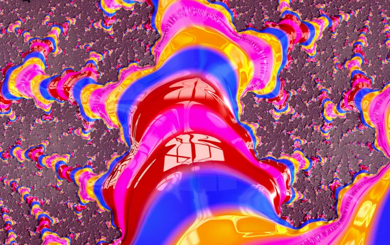
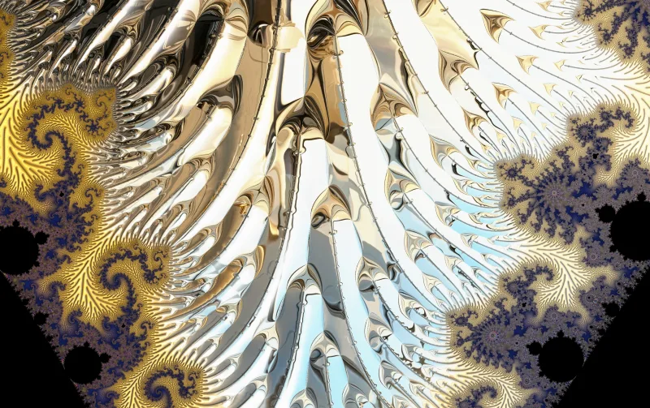
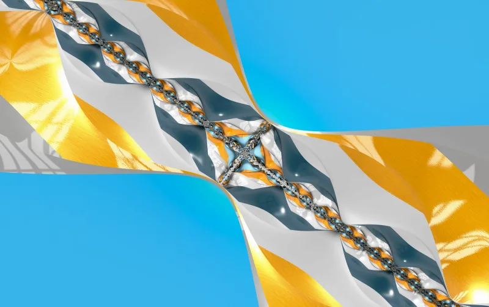
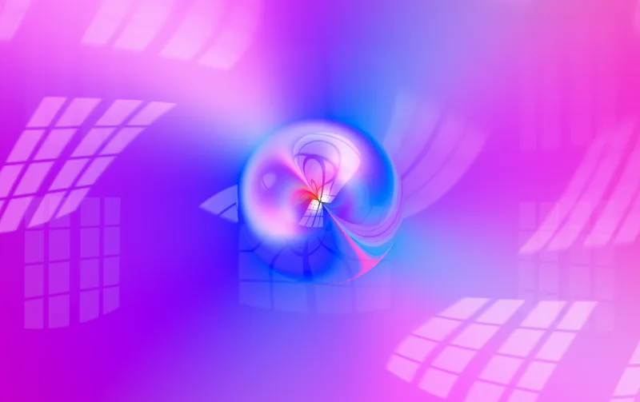
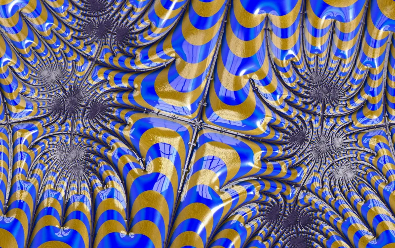

# Mandelbrot Explorer


Explore the Mandelbrot set in your browser, in real time, at any depth. No server, no pre-rendered images: everything is computed live on your machine.

**[Open the explorer →](https://gcollombet.github.io/mandelbrot/)**

Works in Chrome or Edge. Also usable on mobile.

---

## Gallery

<table>
<tr>
<td></td>
<td></td>
</tr>
<tr>
<td></td>
<td></td>
</tr>
<tr>
<td></td>
<td></td>
</tr>
<tr>
<td></td>
<td></td>
</tr>
</table>

<p align="center">
<a href="https://www.youtube.com/watch?v=T7uiOQmYfJQ"></a><br>
<em>Watch a deep zoom video on YouTube</em>
</p>

---

## What you can do

- **Zoom without limits.** Dive as deep as you like, the image keeps refining while you move.
- **Navigate smoothly.** Drag to pan, scroll to zoom, rotate with a right-click drag. Movements have inertia.
- **Color it your way.** A palette editor with color stops, a live preview, and hundreds of ready-made palettes.
- **Give it depth.** Materials such as bronze, marble, lava or wood, with relief, lighting, reflections and shadows.
- **Save your discoveries.** Scenes, palettes and animations are kept in your personal library. Sign in with Google to back them up in the cloud and find them on any device.
- **Animate and export.** Build camera paths, record zoom videos, and recolor a finished render without recomputing it.
- **Take snapshots.** Save the current view as an image in one key press.

## Keyboard

| Key | Action |
|-----|--------|
| Z Q S D or W A S D | Move |
| A / E or Q / E | Rotate |
| R / F | Zoom in / out |
| P, B | Snapshot |
| X, N, C, K, V, I | Open the Scene, Palettes, Animation, Video, Performance and Help panels |

The layout adapts to AZERTY or QWERTY keyboards.

## Run it locally

```bash
npm install
cd reference_calculus && wasm-pack build && cd ..
npm link reference_calculus/pkg
npm link mandelbrot
npm run dev
```

Then open http://localhost:5173.

---

Made by [Guillaume Collombet](https://github.com/gcollombet). Source on [GitHub](https://github.com/gcollombet/mandelbrot).
